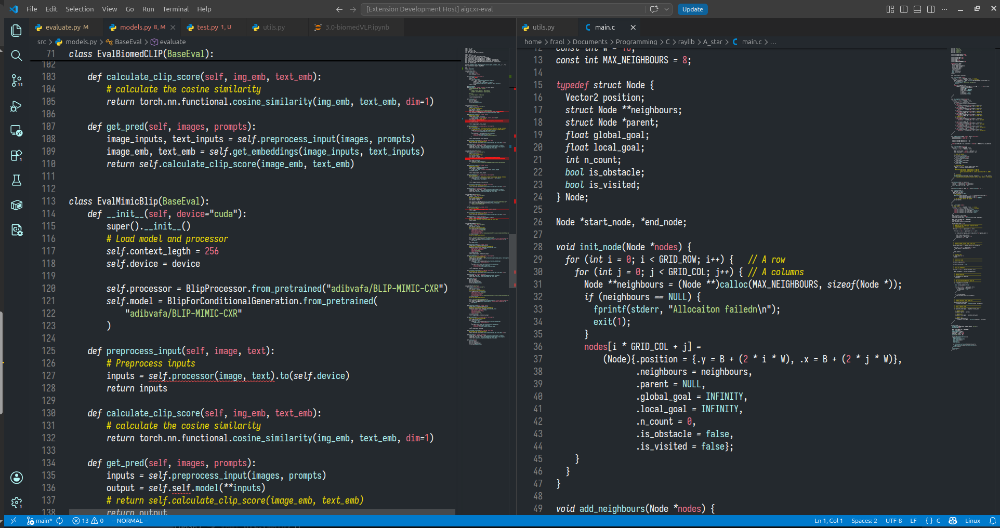
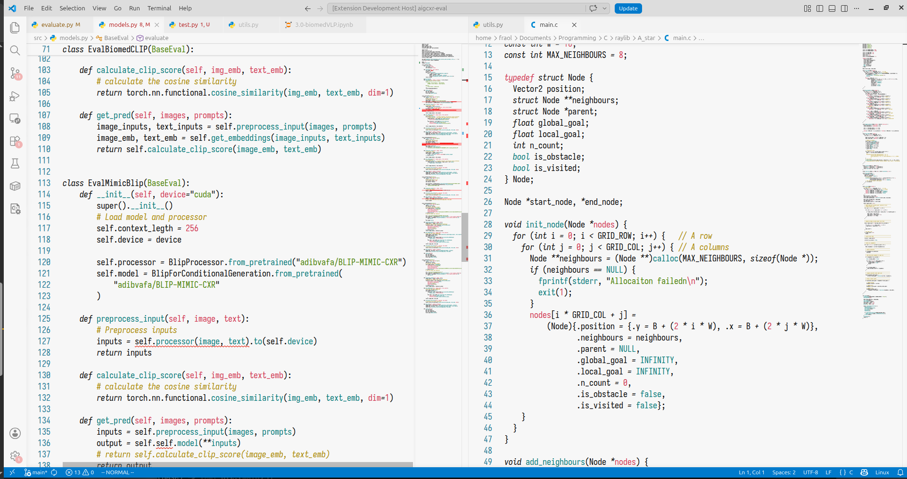

# Yemi Theme

A minimalist color theme blending the typographic layout of **Alabaster** with the cool palette of **Tokyo Night**. Available for both VS Code and Vim/Neovim.

## 🎨 Design Approach

Instead of assigning distinct colors to every token, **Yemi** relies on typography and constraint to keep code clean and readable.

* **Monochromatic Base:** Variables, punctuation, and structures are kept neutral (white/black) to reduce visual noise.
* **Typographic Contrast:** Keywords (`if`, `for`, `return`) use italics rather than a new color to differentiate control flow.
* **Disciplined Accents:** Muted Tokyo Night tones are applied strictly to strings, numbers, and comments for quick scanning.
* **No Clutter:** Rainbow brackets and vertical indentation scope lines are disabled by default.

---

## 🌓 Variants

### Yemi Dark
An soft-gray dark background (`#24292E`) paired with low-intensity neon accents.

### Yemi Light
A soft, cream-gray background (`#f7f7f7`) balancing high legibility with eye comfort.